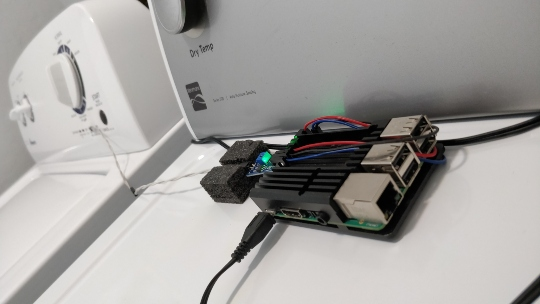
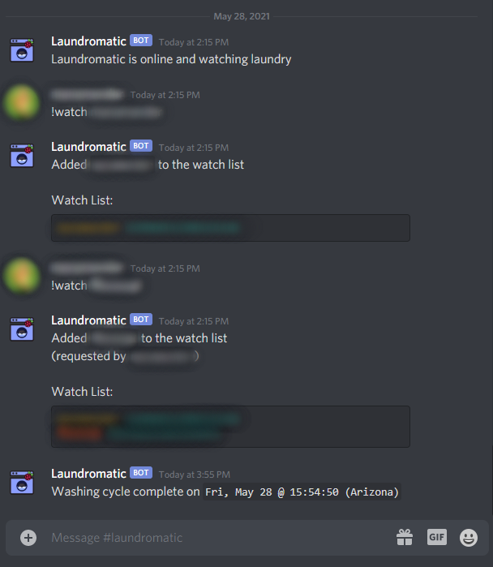
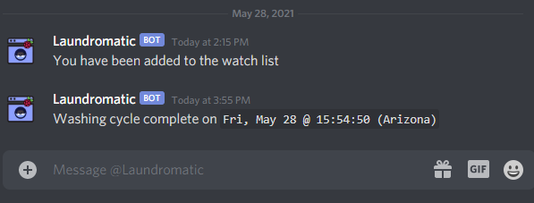
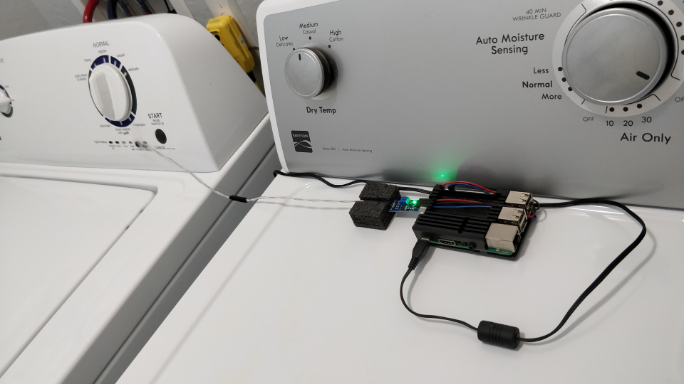
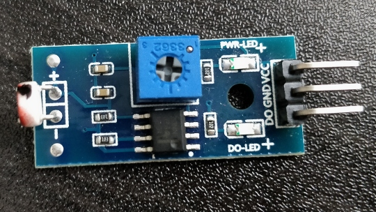
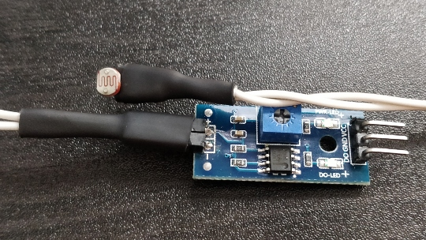
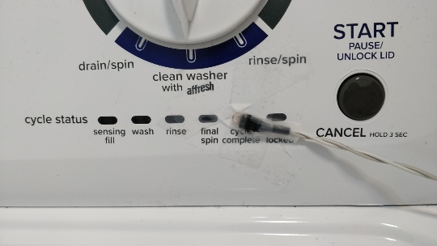

# Laundromatic

Discord Bot that let's you and others know when washing is done.

Built for use with a Raspberry Pi + Photosensitive (light) Sensor Module 
attached via GPIO pins.

&nbsp;


## Example of Use

Here is a brief example use:



This is what that direct messages look like as a watcher:



## How to Setup

### Requirements 

This application requires: 

- A Discord server with a `#laundromatic` channel.
- [Creating a Discord bot](https://discord.com/developers/applications) and using its token.
- At least one [Discord user ID](https://support.discord.com/hc/en-us/articles/206346498-Where-can-I-find-my-User-Server-Message-ID-) for private messages (PMs).
- A Raspberry Pi 3b or 4b
- A photoresistor with DO (digital output)
- Python 3 (recommending 3.8+)

### Clone Project and Install Packages

1. Clone this repository to wherever you would like and change directory to it:

    ```sh 
    git clone <this-project> && cd <project-directory>
    ```

2. Create a virtual environment named "venv" by running:

    ```sh 
    python3 -m venv venv
    ```

3. Source the virtual environment:

    ```sh 
    source venv/bin/activate
    ```

4. Ensure you have GPIO pin access:

    For **Raspberry Pi OS** (formerly "Raspbian"):

    ```sh
    sudo usermod -a -G gpio pi  # replace 'pi' with your username
    ```

    For **Ubuntu Server 20.04**:

    ```sh
    sudo su -
    echo 'KERNEL=="gpiomem", OWNER="root", GROUP="gpio"' > /etc/udev/rules.d/90-gpio.rules
    groupadd -f --system gpio
    usermod -a -G gpio ubuntu # replace 'ubuntu' with your username
    apt-get install gcc python3-dev python3-gpiozero
    sync && reboot
    ```

5. Upgrade pip, setuptools, and wheel:

    ```sh
    pip3 install pip setuptools wheel --upgrade
    ```

6. Install pip packages from requirements.txt:

    ```sh 
    pip install -r requirements.txt
    ```

### Configure Hardware

This is an example of how my final placement looked with everything wired up:



**Photosensitive Sensor Module**

The only hardware needed outside of the Raspberry Pi itself is a 
photoresistor / light detecting resistor (LDR). 

This project makes use of a pre-built "***Photosensitive Sensor Module***":



The reason for using these pre-built sensors is because they come with a 
digital only (DO) output, which is useful since the Raspberry Pi does not 
have native support for analog signals. It is also helpful that these sensors 
have two tiny LEDs on them to visually show when it is powered and when the
light sensor is tripped.

These sensor modules can be found relatively inexpensively online.

**Potentiometer Adjustment**

The output of the sensor is controlled by a potentiometer 
(the `+` sign / Phillip's head screw within the blue square); 
which can be adjusted by turning it clockwise or counter-clockwise.

I recommended adjusting the potentiometer until it only responds to the
washing machine's "done" / "complete" cycle LED but not the ambient light in
your washroom.

**Photoresistor**

It's possible to place the entire sensor module where you want it, but in my 
case I decided to rewire the photoresistor with some longer wires:



This allowed me to just tape the sensor in place:



(NOTE: I'll probably re-tape this with gaffer's tape, 
but regular scotch tape is working well for now.)

**GPIO PINs**

[Official Documentation on GPIO Pins](https://www.raspberrypi.org/documentation/usage/gpio/)

The `VCC` line must be connected to a `3V3 Power` GPIO pin.

The `GND` (ground) line must be connected to a `Ground` GPIO pin.

The `DO` (digital output) line is connected to GPIO pin `4`*.

[Click here for an image showing GPIO Pins](assets/gpiopins.png)

*NOTE: Other GPIO pins can be used instead, but the configuration of the script 
must be set to the pin you choose (see the "How to Use" section below).

## How to Use

### Configuration

This bot will require that you provide it with at least your **bot token**.

Additional optional values can be supplied if desired, such as:
- The Discord `channel` to manage the bot from (defaults to: '`landromatic`') 
- The `delay` required between when completed messages can be sent (defaults to: `30` (minutes))
- The `gpiopin` used for the photoresistor's digital output (defaults to: `4`)
- The `loglevel` to use for logging (defaults to: '`info`')
- The `prefix` used for all commands (defaults to: '`!`')
- The Discord user ID(s) for any `watchers` (they receive direct messages (DMs) of status changes)

These items can be provided in three ways.

You only need to use ***__ONE__*** of these methods, but you can mix-and-match if you'd like.

1. Copy the `config.example.json` file to `config.json`, and then add your token and other desired values:

    ```sh
    cp config.example.json config.json
    
    vim config.json # feel free to use a different editor than vim
    ```

    The file should look similar to this:

    ```json
    {
        "token":    "REQUIRED-your-bot-token-here",
        "channel":  "laundromatic",
        "delay":    30,
        "gpiopin":  4,
        "loglevel": "info",
        "prefix":   "!",
        "watchers": [
            "optional-your-user-id-here"
        ]
    }
    ```

    *NOTE: Additional user IDs can be added to the "watchers" list (notice the trailing commas):*

    ```json
    {
        "token":    "REQUIRED-your-bot-token-here",
        "channel":  "laundromatic",
        "delay":    30,
        "gpiopin":  4,
        "loglevel": "info",
        "prefix":   "!",
        "watchers": [
            "optional-your-user-id-here",
            "optional-additional-user-id-here",
            "optional-as-many-as-you-want"
        ]
    }
    ```

2. Provide the token and other desired values as environment variables:

    Run the following on the command line:

    ```sh
    # NOTE: do not add spaces before or after the "=" (equal sign)
    export LAUNDROMATIC_TOKEN='REQUIRED-token-goes-here'
    export LAUNDROMATIC_CHANNEL='laundromatic'
    export LAUNDROMATIC_DELAY=30
    export LAUNDROMATIC_GPIOPIN='4'
    export LAUNDROMATIC_LOGLEVEL='info'
    export LAUNDROMATIC_PREFIX='!'
    export LAUNDROMATIC_WATCHERS='optional-user-id-one optional-user-id-two' # space-separated list
    ```

    For added security, use `read` to hide sensitive values from command history:

    ```sh
    read -s -p "Token: " LAUNDROMATIC_TOKEN && export LAUNDROMATIC_TOKEN
    ```

3. Pass the token (or base64 encoded token) and watcher/watchers via command line arguments:

    The command line supports the following arguments when running the script:
    
    ```txt
    [-h | --help]
    (-t TOKEN    | -b           TOKEN   )
    [-c CHANNEL  | --channel    CHANNEL ]
    [-d DELAY    | --delay      DELAY   ]
    [-g GPIOPIN  | --gpiopin    GPIOPIN ]
    [-l LOGLEVEL | --loglevel   LOGLEVEL] 
    [-p PREFIX   | --prefix     PREFIX  ]
    [-w WATCHER  | --watcher    WATCHER | --watchers WATCHERS [WATCHERS ...]]

    -h, --help
                            show this help message and exit
    -t TOKEN, --token TOKEN
                            Token
    -b TOKEN, --base64_token TOKEN
                            Token (base64)
    -c CHANNEL, --channel CHANNEL
                            Channel Name for management
    -d DELAY, --delay DELAY
                            Delay (minutes) between "complete" messages
    -g GPIOPIN, --gpiopin GPIOPIN
                            GPIO pin for digital output (DO) from light sensor (LDR)
    -l, --loglevel
                            Logging Level (debug | info | warning | error | critical)
    -p PREFIX, --prefix PREFIX
                            Token (base64)
    -w WATCHER, --watcher WATCHER
                            User ID of Watcher (can be used multiple times) 
    --watchers WATCHERS [WATCHERS ...]
                            User IDs for Watchers (space separated list)
    ```

    An example of running the script:

    Long argument style:

    ```sh
    ./main.py --token 'REQUIRED-token-goes-here' --channel 'laundromatic' --delay '30' --gpiopin '4' --prefix '!'  --loglevel 'debug' --watcher 'optional-my-user-id' --watcher 'optional-some-other-user-id'
    ```

    Short argument style:

    ```sh
    ./main.py -t 'REQUIRED-token-goes-here' -c 'laundromatic' -d '30' -g '4' -p '!' -l 'debug' -w 'optional-my-user-id' -w 'optional-some-other-user-id'
    ```

    A few more examples of using command line arguments:

    ```sh
    # if values are already provided in config.json and/or environment variables
    ./main.py 

    # base64 encoded tokens are supported too
    ./main.py --base64_token 'REQUIRED-base64-encoded-token'

    # watchers argement accepts a space separated list, and can replace multiple watcher/w arguments
    ./main.py --token 'REQUIRED-token-goes-here' --watchers 'optional-my-user-id optional-some-other-user-id'
    ```

## Bot Commands

There are several supported bot commands that can be used once the bot is online.

The commands may be ran within the: 

1. Main management channel (defined in configuration above, default '`#laundromatic`')
2. Direct message (DM) window with the bot.

The commands must be prefixed by the assigned prefix (also defined in the configuration above, default '`!`').

NOTE: For the sake of readability, the following details on each command will use the default prefix.

### Get User ID by Name

Provides a message with the user ID of any username passed to it.

NOTE: The username field can be left blank if you wish to get your own user ID.

Command: `!id [username]`

Aliases: `!get-id`, `!user-id`, `!uid`


### List Watch List

Provides a message of all current users on the watch list.

Command: `!watchlist`

Aliases: `!watchers`, `!list`, `!users`

### Send DMs from Bot to All Watchers

Sends a direct message (DM) to all current users on the watch list.

Provide the message you wish to send within quotes.

Command: `!broadcast "your message"`

Aliases: `!dm`

### Add User to Watch List

Adds a user or users to the watch list.

The command accepts user IDs and usernames (without the discriminator `#<numbers>` part of a full username).

Command: `!add ([username-or-id] ... [additional-username-or-id])`

Aliases: `!watch`, `!subscribe`

### Remove User from Watch List

Removes a user or users from the watch list.

The command accepts user IDs and usernames (without the discriminator `#<numbers>` part of a full username).

Command: `!remove ([username-or-id] ... [additional-username-or-id])`

Aliases: `!unwatch`, `!unsubscribe`, `!stop`