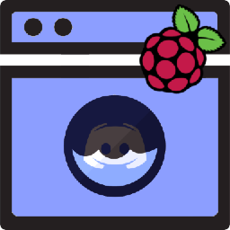

# Laundromatic

Discord Bot that sends laundry status messages.
Built for use with a Raspberry Pi + photoresistor (light sensor) attached via GPIO pins.



## How to Setup

### Requirements 

This application requires: 

- A Discord server with a `#laundromatic` channel.
- [Creating a Discord bot](https://discord.com/developers/applications) and using its token.
- At least one [Discord user ID](https://support.discord.com/hc/en-us/articles/206346498-Where-can-I-find-my-User-Server-Message-ID-) for private messages (PMs).
- A Raspberry Pi 3b or 4b
- A photoresistor with DO (digital output)
- Python 3

### Clone Project and Install Packages

1. Clone this repository to wherever you would like and change directory to it:

    ```sh 
    git clone <this-project> && cd <project-directory>
    ```

2. Create a virtual environment named "venv" by running:

    ```sh 
    python3 -m venv venv
    ```

3. Source the virtual environment:

    ```sh 
    source venv/bin/activate
    ```

4. Install pip packages from requirements.txt:

    ```sh 
    pip install -r requirements.txt
    ```

### Configure Hardware

Coming Soon&trade;

## How to Use

This bot will require that you provide it with your **bot token** and at least one **user ID** for subscription to private messages (PMs) that the bot sends.

These items can be provided in three ways.

You only need to use ***__ONE__*** of these methods, but you can mix-and-match if you'd like.

1. Copy the `config.example.json` file to `config.json`, and then add your token and user ID values to it:

    ```sh
    cp config.example.json config.json
    
    vim config.json # feel free to use a different editor than vim
    ```

    The file should look similar to this:

    ```json
    {
        "token": "your-bot-token-here",
        "watchers": [
            "your-user-id-here"
        ],
        "prefix": "!",
        "loglevel": "INFO"
    }
    ```

    *NOTE: Additional user IDs can be added to the "watchers" list (notice the commas):*

    ```json
    {
        "token": "your-bot-token-here",
        "watchers": [
            "your-user-id-here",
            "additional-user-id-here",
            "as-many-as-you-want"
        ],
        "prefix": "!",
        "loglevel": "INFO"
    }
    ```

2. Provide the token and watchers list as environment variables:

    Run the following on the command line:

    ```sh
    # do not add spaces before or after the "=" (equal sign)
    export DISCORD_TOKEN='token-goes-here'
    export DISCORD_WATCHERS='user-id-one user-id-two user-id-three' # space-separated list
    ```

    For added security, use `read` to hide sensitive values from command history:

    ```sh
    read -s -p "Token: " DISCORD_TOKEN && export DISCORD_TOKEN
    read -s -p "Watchers: " DISCORD_WATCHERS && export DISCORD_WATCHERS
    ```

3. Pass the token (or base64 encoded token) and watcher/watchers via command line arguments:

    The command line supports the following arguments when running the script:
    
    ```txt
    [-h]
    [-l LOGLEVEL | --loglevel LOGLEVEL] 
    (-t TOKEN | -b TOKEN) 
    (-w WATCHER | --watcher WATCHER | --watchers WATCHERS [WATCHERS ...])

    -h, --help              
                            show this help message and exit
    -l, --loglevel          
                            Logging Level (debug | info | warning | error | critical)
    -t TOKEN, --token TOKEN
                            Token
    -b TOKEN, --base64_token TOKEN
                            Token (base64)
    -w WATCHER, --watcher WATCHER
                            User ID of Watcher (can be used multiple times) 
    --watchers WATCHERS [WATCHERS ...]
                            User IDs for Watchers (space separated list)
    ```

    An example of running the script:

    ```sh
    ./main.py --loglevel 'debug' --token 'my-token-goes-here' --watcher 'my-user-id' --watcher 'some-other-user-id'
    ```

    A few more examples of using command line arguments:

    ```sh
    ./main.py --base64_token 'base64-encoded-token' --watchers 'my-user-id some-other-user-id'

    ./main.py --token 'my-token-goes-here' --watchers 'my-user-id some-other-user-id'--loglevel 'debug'

    ./main.py -l 'debug' -t 'my-token-goes-here' --watchers 'my-user-id some-other-user-id'
    ```


## TODO

Things I'd like to get around to, eventually...

0. ~~Write instructions for setup and use.~~
1. ~~Possibly add config file parsing.~~
2. ~~Add logging.~~
3. Add tests to verify code works as expected with changes.
4. Modularize the code into parts for easier maintenance.
5. Containerize code and put into image repo.